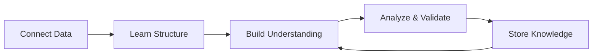

## The Learning Loop

SkoutLab isn't a static tool — it's a system that continuously learns and improves:

## What Gets Learned

### Data Understanding

As Knowledge Builder runs, it learns:

| Category | Examples |
|----------|----------|
| **Structure** | Tables, columns, relationships, keys |
| **Semantics** | What fields mean in business terms |
| **Quality** | Missing values, inconsistencies, errors |
| **Patterns** | Typical values, distributions, seasonality |

### Business Context

Over time, SkoutLab understands:

- Which metrics matter most to you
- How different data sources relate
- What's "normal" for your business
- Seasonal and cyclical patterns

### Analytical Patterns

With each analysis, SkoutLab learns:

- Which hypotheses tend to be fruitful
- What types of findings you act on
- Common patterns in your industry

## How Learning Improves Results

### Faster Analysis

First analysis of a new dataset might take time to understand structure. Later analyses are faster because:
- Schema is already known
- Relationships mapped
- Quality issues documented

### Better Accuracy

Understanding context prevents errors:
- Knows that "revenue" in Table A = "sales" in Table B
- Remembers that negative values mean refunds
- Aware of timezone issues in timestamps

### Richer Insights

Historical knowledge enables deeper insights:
- Compare current patterns to historical baselines
- Detect anomalies based on learned norms
- Surface trends that span multiple analysis sessions

## The Knowledge Graph

Behind the scenes, SkoutLab builds a knowledge graph of your business:

<AccordionGroup>
  <Accordion title="Entities">
    Customers, Products, Orders, Employees — the "nouns" in your data
  </Accordion>
  <Accordion title="Relationships">
    How entities connect: Customers place Orders, Orders contain Products
  </Accordion>
  <Accordion title="Metrics">
    Key measures and how they're calculated
  </Accordion>
  <Accordion title="Patterns">
    Known behaviors, seasonality, trends
  </Accordion>
  <Accordion title="History">
    Past findings, validated hypotheses, actions taken
  </Accordion>
</AccordionGroup>

## Continuous vs On-Demand

| Mode | When to Use |
|------|-------------|
| **Continuous** | Fresh data arriving regularly, need ongoing context refresh |
| **On-Demand** | Periodic analysis, cost-conscious, stable datasets |

<Tip>
For most users, running Knowledge Builder periodically (e.g., daily or weekly) provides good results while managing costs.
</Tip>

## Privacy & Control

Your learning data is:
- Isolated to your account
- Never shared with other users
- Deletable at any time
- Not used to train general models
